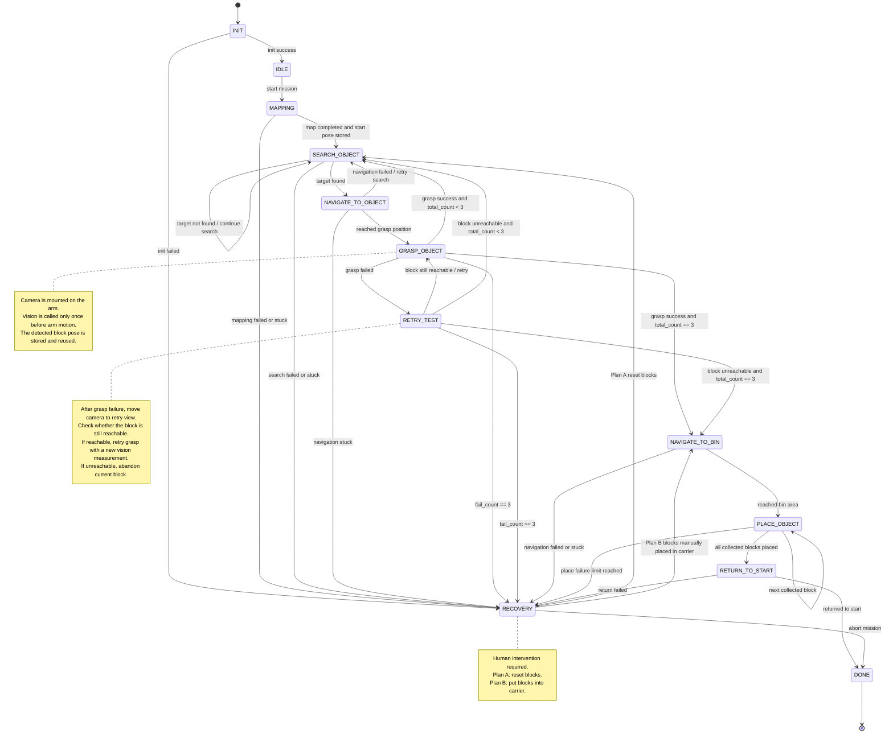

# Robot State Machine

## Overview

This repository contains the preliminary ROS 2 state machine logic for a mobile manipulation robot based on a LeoRover platform with an Elephant robot arm mounted on top.

The robot is designed to complete the following mission:

1. Build or use a map of the operating environment.
2. Search for three coloured blocks.
3. Navigate to each detected block.
4. Grasp the block and place it into the rear carrier on the robot.
5. Navigate back to the starting/bin area.
6. Detect the corresponding coloured bins.
7. Place the collected blocks into the matching bins.
8. Return to the starting point.

The state machine is divided into four main operational phases:

- **Preparation**
- **Collecting**
- **Placing**
- **Recovery**

> All content in this repository is still a draft and may be changed during further implementation and testing.

---

## System Architecture

The state machine is responsible for high-level mission sequencing. Low-level functions such as mapping, navigation, vision, grasping, placing, and operator recovery are handled by separate ROS 2 nodes.

Recommended node structure:

```text
robot_state_machine_node
│
├── mapping_manager_node
│   ├── SLAM / mapping node
│   ├── map saver service
│   └── start pose storage
│
├── vision_node
│   ├── camera subscriber
│   ├── detect_block_once service
│   ├── detect_bin_once service
│   └── set_vision_mode service
│
├── approach_object_node
│   ├── Nav2 NavigateToPose action client
│   ├── local alignment controller
│   └── ApproachTarget action server
│
├── grasp_node
│   ├── arm controller
│   ├── gripper control
│   └── GraspBlock action server
│
├── place_node
│   ├── bin detection
│   ├── arm controller
│   ├── gripper control
│   └── PlaceBlock action server
│
└── operator_interface_node
    └── recovery command service / topic
```

---

## ROS 2 Communication Design

The system uses different ROS 2 communication methods depending on the type of task.

| Function | Recommended ROS 2 Method | Reason |
|---|---|---|
| Camera image stream | Topic | Continuous high-frequency data |
| LiDAR scan | Topic | Continuous sensor data |
| Robot pose / odometry | Topic / TF | Continuously changing pose information |
| Map data | Topic | SLAM continuously publishes map updates |
| Coordinate transforms | TF | Required for camera, arm, base, and map frame conversion |
| Save map | Service | Short one-time request |
| Set vision mode | Service | Quick mode switching |
| Detect block once | Service | One-shot detection request |
| Detect bin once | Service | One-shot detection request |
| Open / close gripper | Service | Simple short command |
| Navigate to pose | Action | Long-running task with feedback and result |
| Approach target object | Action | Long-running navigation and alignment behaviour |
| Move arm to view pose | Action | Arm motion takes time and may fail |
| Grasp block | Action | Multi-step manipulation task |
| Place block | Action | Multi-step manipulation task |
| Human recovery decision | Service / Topic | Operator input for recovery mode |
| Mission state display | Topic | Useful for debugging and GUI visualisation |

General rule:

```text
Continuous data stream      → Topic
Short request and response  → Service
Long-running task           → Action
Coordinate transformation   → TF
```

---

## States

The system currently uses the following core states:

```text
INIT
IDLE
MAPPING
SEARCH_OBJECT
NAVIGATE_TO_OBJECT
GRASP_OBJECT
RETRY_TEST
NAVIGATE_TO_BIN
PLACE_OBJECT
RETURN_TO_START
RECOVERY
DONE
```

Recommended enum-style representation:

```python
class State:
    INIT = "INIT"
    IDLE = "IDLE"
    MAPPING = "MAPPING"
    SEARCH_OBJECT = "SEARCH_OBJECT"
    NAVIGATE_TO_OBJECT = "NAVIGATE_TO_OBJECT"
    GRASP_OBJECT = "GRASP_OBJECT"
    RETRY_TEST = "RETRY_TEST"
    NAVIGATE_TO_BIN = "NAVIGATE_TO_BIN"
    PLACE_OBJECT = "PLACE_OBJECT"
    RETURN_TO_START = "RETURN_TO_START"
    RECOVERY = "RECOVERY"
    DONE = "DONE"
```

---

## Counters

The state machine uses counters to track grasping and placing progress.

### Grasping counters

| Counter | Meaning |
|---|---|
| `total_count` | Number of blocks that have been processed, including success and abandoned failures |
| `success_count` | Number of blocks successfully grasped and placed into the rear carrier |
| `fail_count` | Number of blocks abandoned because they are no longer reachable |
| `max_blocks` | Total number of blocks to process, normally 3 |
| `max_fail_count` | Maximum allowed failure count before recovery |

The expected relation is:

```text
total_count = success_count + fail_count
```

When:

```text
total_count == 3
```

the robot stops collecting blocks and transitions to `NAVIGATE_TO_BIN`.

### Placing counters

| Counter | Meaning |
|---|---|
| `total_place_count` | Number of placement attempts |
| `succeed_place_count` | Number of successful placements |
| `fail_place_count` | Number of failed placement attempts |

The placing phase should normally place only the blocks that were successfully collected:

```text
succeed_place_count == success_count
```

This is more flexible than always requiring three successful placements, because some blocks may have been abandoned during the collecting phase.

---

## Operational Workflow

## 1. Preparation Phase

### INIT

The `INIT` state initializes the ROS 2 system and checks whether the required interfaces are available.

Main responsibilities:

- Start ROS 2 context.
- Create the `robot_state_machine_node`.
- Connect to the Nav2 `navigate_to_pose` action server.
- Prepare vision service clients.
- Prepare grasp and place action clients.
- Subscribe to LiDAR, camera, odometry, and other required sensor topics.
- Check whether key nodes are available before starting the mission.

Transition:

```text
INIT → IDLE
```

If initialization fails:

```text
INIT → RECOVERY
```

---

### IDLE

The `IDLE` state acts as a short waiting or buffer state before starting the main mission.

It may be used to:

- Wait for an operator start command.
- Wait for all nodes to become ready.
- Move the arm to its home position.
- Reset mission variables.

Transition:

```text
IDLE → MAPPING
```

---

## 2. Mapping Phase

### MAPPING

The `MAPPING` state is responsible for mapping the environment and storing the starting pose.

Main responsibilities:

- Start mapping or exploration.
- Store the starting pose in the `map` frame.
- Build or update the environment map.
- Optionally store potential target or bin positions detected during mapping.
- Save the map using a map saver service.

Possible optimisations:

- **Plan A:** Store potential target positions during mapping to make later navigation faster.
- **Plan B:** Interrupt or shorten mapping if a target is detected early and the map is sufficient for navigation.

Transition:

```text
MAPPING → SEARCH_OBJECT
```

Failure transition:

```text
MAPPING → RECOVERY
```

---

## 3. Collecting Phase

The collecting phase handles searching, navigating to, and grasping coloured blocks.

Main state sequence:

```text
SEARCH_OBJECT → NAVIGATE_TO_OBJECT → GRASP_OBJECT
```

---

### SEARCH_OBJECT

The `SEARCH_OBJECT` state searches for the next coloured block.

The target may be located through:

- Direct camera-based colour detection.
- Candidate positions stored during mapping.
- LiDAR-based detection of known structures such as white bin bases.
- A search node that combines map, LiDAR, and vision data.

Main responsibilities:

- Call the vision node or search object node.
- Detect the next target block.
- Store the candidate target position.
- Decide whether the robot should navigate to the target.

Transitions:

```text
SEARCH_OBJECT → NAVIGATE_TO_OBJECT
```

if a target is found.

```text
SEARCH_OBJECT → SEARCH_OBJECT
```

if no target is found and the search should continue.

```text
SEARCH_OBJECT → RECOVERY
```

if the robot becomes stuck or the search repeatedly fails.

---

### NAVIGATE_TO_OBJECT

The `NAVIGATE_TO_OBJECT` state moves the robot to a graspable position near the target block.

Main responsibilities:

- Use the map and target pose to navigate near the block.
- Approach the block until it is inside the arm workspace.
- Optionally activate vision when the robot is close to the target, for example within 80 cm.
- Perform local alignment before grasping.

Recommended implementation:

```text
State Machine → ApproachTarget Action → Nav2 NavigateToPose Action
```

Transitions:

```text
NAVIGATE_TO_OBJECT → GRASP_OBJECT
```

if the robot reaches the grasp position.

```text
NAVIGATE_TO_OBJECT → SEARCH_OBJECT
```

if navigation fails but the system can retry searching.

```text
NAVIGATE_TO_OBJECT → RECOVERY
```

if the robot is stuck or navigation fails critically.

---

### GRASP_OBJECT

The `GRASP_OBJECT` state performs one grasp attempt.

Because the camera is mounted on the robot arm, the vision system must be called only once at the beginning of each grasp attempt. The detected block pose is stored before the arm starts moving.

Important design rule:

```text
Call vision once → store block pose → move arm → do not update pose during arm motion
```

Reason:

Once the arm starts moving, the camera frame also moves. Updating the target pose during arm motion may cause unstable or incorrect grasp commands.

Main responsibilities:

- Call the vision node once.
- Store the detected block position and orientation.
- Send the stored pose to the grasp action server.
- Close the gripper and move the block to the rear carrier.
- Wait for the grasp result.

#### Success logic

If grasping succeeds:

```python
total_count += 1
success_count += 1
```

Then:

```text
if total_count < 3:
    GRASP_OBJECT → SEARCH_OBJECT
```

```text
if total_count == 3:
    GRASP_OBJECT → NAVIGATE_TO_BIN
```

#### Failure logic

If grasping fails:

```text
GRASP_OBJECT → RETRY_TEST
```

The failure is not immediately counted as `fail_count += 1`, because the block may still be reachable and can be retried.

#### Recovery logic

If the failure limit is reached:

```text
GRASP_OBJECT → RECOVERY
```

---

### RETRY_TEST

The `RETRY_TEST` state checks whether a failed block is still reachable.

This state is required because the block may have slipped, moved, or fallen after a failed grasp attempt.

Since the camera is mounted on the arm, the arm or camera should first move to a view pose facing the possible falling area, bin surface, carrier surface, or reachable workspace.

Main responsibilities:

- Move the arm/camera to a retry-view pose.
- Call the vision node once.
- Check whether the block is still visible.
- Check whether the detected block pose is inside the arm reachable workspace.
- Decide whether to retry the grasp or abandon the current block.

#### If the block is still reachable

```text
RETRY_TEST → GRASP_OBJECT
```

The system resets the grasp context and returns to `GRASP_OBJECT`. A new vision call is made to obtain the updated block pose before retrying.

#### If the block is not reachable

```python
total_count += 1
fail_count += 1
```

Then:

```text
if total_count < 3:
    RETRY_TEST → SEARCH_OBJECT
```

```text
if total_count == 3:
    RETRY_TEST → NAVIGATE_TO_BIN
```

```text
if fail_count == 3:
    RETRY_TEST → RECOVERY
```

This means the current block is considered processed but failed.

---

## 4. Placing Phase

The placing phase handles transporting collected blocks to the correct bins.

Main state sequence:

```text
NAVIGATE_TO_BIN → PLACE_OBJECT → RETURN_TO_START
```

---

### NAVIGATE_TO_BIN

The `NAVIGATE_TO_BIN` state navigates the robot back to the starting area or bin area.

Main responsibilities:

- Use the saved start pose or bin area pose.
- Send a navigation goal to Nav2.
- Wait until the robot reaches the bin area.

Transition:

```text
NAVIGATE_TO_BIN → PLACE_OBJECT
```

Failure transition:

```text
NAVIGATE_TO_BIN → RECOVERY
```

---

### PLACE_OBJECT

The `PLACE_OBJECT` state places collected blocks into their corresponding coloured bins.

Main responsibilities:

- Select the next block currently stored in the rear carrier.
- Call the vision node to detect the matching coloured bin.
- Align the robot or arm with the bin.
- Send the place command to the place action server.
- Open the gripper and release the block.
- Update placement counters.

Success:

```python
total_place_count += 1
succeed_place_count += 1
```

Failure:

```python
total_place_count += 1
fail_place_count += 1
```

If there are still successfully collected blocks remaining:

```text
PLACE_OBJECT → PLACE_OBJECT
```

If all collected blocks have been placed:

```text
PLACE_OBJECT → RETURN_TO_START
```

If placement fails repeatedly:

```text
PLACE_OBJECT → RECOVERY
```

---

### RETURN_TO_START

The `RETURN_TO_START` state sends the robot back to the starting point after placement is complete.

Transition:

```text
RETURN_TO_START → DONE
```

Failure transition:

```text
RETURN_TO_START → RECOVERY
```

---

## 5. Recovery Phase

### RECOVERY

The `RECOVERY` state acts as a safety buffer for failures that cannot be solved automatically.

Recovery may be triggered by:

- ROS 2 initialization failure.
- Mapping failure.
- Robot getting stuck during search, navigation, or placing.
- Grasp failure limit reached.
- Placement failure limit reached.
- Vision node repeatedly failing to detect required targets.
- Arm or gripper action failure.

Recovery requires human intervention.

### Plan A: Reset Blocks

The operator resets all three blocks or only the last failed block.

Transition:

```text
RECOVERY → SEARCH_OBJECT
```

This allows the robot to continue the collecting phase.

### Plan B: Put Blocks into Carrier

The operator manually places the remaining blocks into the rear carrier.

Transition:

```text
RECOVERY → NAVIGATE_TO_BIN
```

This allows the robot to skip the remaining grasping process and continue to the placing phase.

### Abort

If the mission cannot continue:

```text
RECOVERY → DONE
```

---

## Overall Information Flow

### Mapping

```text
robot_state_machine_node
    → mapping_manager_node
        → SLAM node publishes /map
        → TF provides map → base_link transform
        → map saver service stores map
    ← start_pose and map status
```

Main communication:

```text
/map                 Topic
/tf                  TF
/save_map            Service
/navigate_to_pose    Action
```

---

### Searching for Blocks

```text
robot_state_machine_node
    → vision_node / search_object_node
        → camera image topic
        → block detection
    ← target block pose
```

Main communication:

```text
/camera/image_raw             Topic
/vision/detect_block_once     Service
/search_object                Service or Action
```

---

### Navigating to Blocks

```text
robot_state_machine_node
    → approach_object_node
        → Nav2 NavigateToPose
        → local alignment controller
    ← reached grasp position
```

Main communication:

```text
/approach_target      Action
/navigate_to_pose     Action
/cmd_vel              Topic
/tf                   TF
```

---

### Grasping

```text
robot_state_machine_node
    → vision_node
        → detect block once
    ← block pose

robot_state_machine_node
    → grasp_node
        → arm motion
        → gripper close
        → move block to rear carrier
    ← grasp result
```

Main communication:

```text
/vision/detect_block_once     Service
/grasp_block                  Action
/open_gripper                 Service
/close_gripper                Service
/joint_states                 Topic
/tf                           TF
```

---

### Retry Test

```text
robot_state_machine_node
    → grasp_node / arm_view_node
        → move camera to retry-view pose
    ← camera ready

robot_state_machine_node
    → vision_node
        → detect block once
    ← reachable / unreachable
```

Main communication:

```text
/move_arm_to_view_pose        Action
/vision/detect_block_once     Service
/tf                           TF
```

---

### Placing

```text
robot_state_machine_node
    → vision_node
        → detect corresponding bin
    ← bin pose

robot_state_machine_node
    → place_node
        → move arm to bin
        → open gripper
        → release block
    ← place result
```

Main communication:

```text
/vision/detect_bin_once       Service
/place_block                  Action
/open_gripper                 Service
/close_gripper                Service
/tf                           TF
```

---

### Recovery

```text
robot_state_machine_node
    → operator_interface_node
    ← RESET_BLOCKS / PUT_IN_CARRIER / ABORT
```

Main communication:

```text
/operator/recovery_decision   Service
/recovery_command             Topic
```

---

## State Machine Diagram


